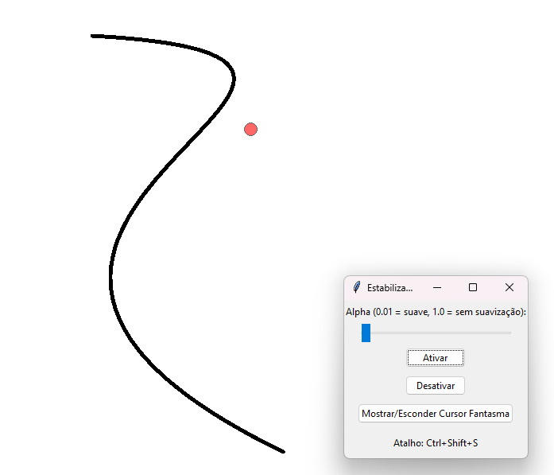

# Universal-Cursor-Stabilizer

**`smooth.py`** is a atempt to create a Python tool that **stabilizes your mouse movements in any application**, helping you draw smoother lines and curves everywhere — from Photoshop, Krita, and Paint Tool SAI to browser-based or 3D sculpting software.

It adds a gentle **lag-based smoothing filter** to your cursor, making shaky hand movements glide smoothly like digital “hand stabilizers” found in professional art programs.




---

## ✨ Features

* 🧠 **Universal** – Works in *any app* that uses the system cursor (drawing, design, games, 3D tools, browsers).
* 🌀 **Real-time smoothing** – Uses a simple exponential moving average to smooth out cursor motion.
* 👁️ **Optional overlay** – Displays a red “ghost cursor” showing the smoothed position.
* ⚙️ **Adjustable alpha** – Control the smoothing intensity (from very soft to almost raw movement).
* ⌨️ **Global hotkey** – Toggle the stabilizer anytime with `Ctrl + Shift + S`.
* 🪶 **Simple GUI** – Minimal interface with start/stop buttons and a smoothness slider.

---

## ⚙️ Requirements

Make sure you have Python 3.8+ and install dependencies:

```bash
pip install pyautogui pynput keyboard
```

`tkinter` comes preinstalled with most Python distributions, but if missing:

```bash
sudo apt install python3-tk
```


## 🧠 Best Use Cases

* ✏️ Drawing smoother strokes in Photoshop, Krita, Clip Studio Paint, etc.
* 🎨 Tracing or shadowing reference images (works perfectly with the `image_overlay.py` tool).
* 🖱️ Fine cursor control for pixel art or detail retouching.
* 💻 Smoother line motion in browser-based drawing tools or digital whiteboards.


